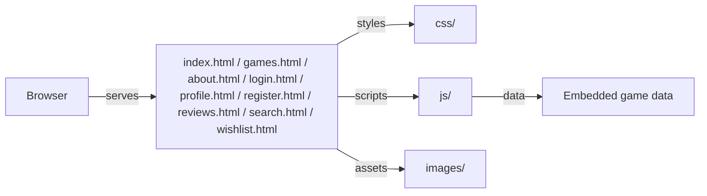

# Metaplay

Static game discovery and review platform. Browse curated games, compare meta scores, read community reviews, and manage a wishlist.

## Overview

A multi-page static website for game discovery. Users browse trending and top-rated games, read expert reviews and community ratings, filter by platform, and maintain a personal wishlist. Built with vanilla HTML, CSS, and JavaScript — no build step required.

## Core Architecture



## System Components

| Component | Responsibility |
|---|---|
| `index.html` | Homepage with trending games and game of the week |
| `games.html` | Full game catalog with platform filtering |
| `about.html` | About MetaPlay |
| `reviews.html` | Community review listings |
| `search.html` | Game search with suggestions |
| `wishlist.html` | Personal wishlist management |
| `login.html` / `register.html` | User authentication forms |
| `profile.html` | User profile page |
| `css/` | Site-wide and page-specific styles |
| `js/` | Client-side game data, rendering, interactivity |
| `images/` | Game cover art and branding |

## Repository Layout

| Directory | Purpose |
|---|---|
| `css/` | Stylesheets |
| `js/` | JavaScript modules for data, pages, and features |
| `images/` | Game covers and assets |

## Technology Stack

| Layer | Technology | Purpose |
|---|---|---|
| Structure | HTML5 | Multi-page markup |
| Styling | CSS3 | Visual design and dark theme |
| Interactivity | Vanilla JavaScript | Game rendering, search, wishlist, auth |

## Requirements

- Any modern web browser
- No build step or runtime dependencies

## Configuration

No configuration files. Open `index.html` directly in a browser.

## Getting Started

```bash
git clone <repo-url>
cd Metaplay
open index.html
```

## Development

Edit HTML, CSS, or JS files directly. Refresh browser to see changes.
